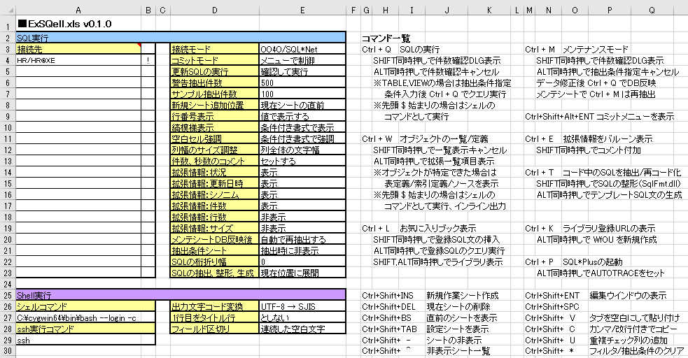
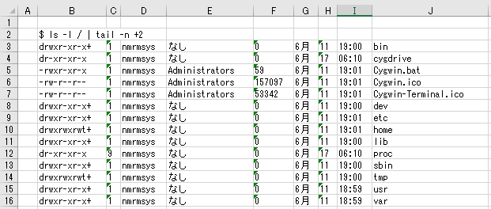
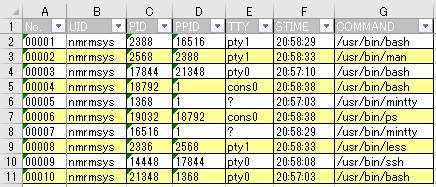

ExSQell = Excel + SQL + Shell
====
Let's running a SQL statements and Shell commands in Excel

## Usage
- When you press Ctrl + Q to a cell that is written by SQL statement or shell command , it outputs the run result
- See "How to Use" sheet for details  

## Features
- Run SQL statement
- DB Object List, Definition Viewer
- Table Query Editor
- Table Data Maintenance
- SQL Beautifier, Converter, Generator
- Run shell command [New]

## Requirement
- Microsoft Windows
- Microsoft Excel
- (Optional: Run Shell Command) Cygwin or Other UNIX Environment Clone Currently  "Bash on Ubuntu on Windows" is not supported. Only 64bit MS-Office Comming Soon.

## Screenshot
Settings Sheet 
 

Inline Output 
 

Auto Filter Sheet 
 

## Licence
[MIT](http://opensource.org/licenses/mit-license.php)

## Author
[nmrmsys](https://github.com/nmrmsys)
